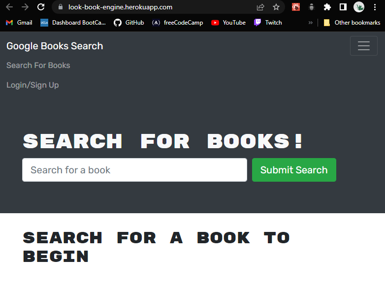

# Look Book Engine

# Snapshots

# Table of Contents
* [Description](#description)
* [Installation](#installation)
* [Packages Used](#packages-used)
* [Contact](#contact)

# Description
  A react web application that allows users to search for books by title or author. Check it out [here!](https://lookbook-engine.herokuapp.com/)

# Installation

* Download or clone repository
* Use a text editor to view all coding, Visual Studio Coding is recommended.
* Within the command line:
   * Open up the <code>Command line</code> within VS code
   * Run: <code>npm init -y</code>
   * Followed by: 
       * <code>npm install</code>
   * Run react app: <code>npm start</code>

# Packages Used
  * Apollo
  * Graph QL
 
# Contact
<a href="https://github.com/VAalchemist">Github: VAalchemist</a>

[Return to top](#look-book-engine)